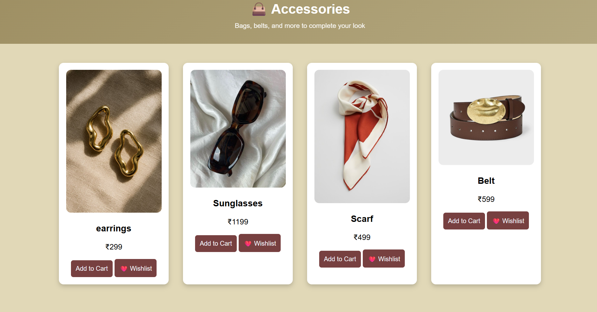
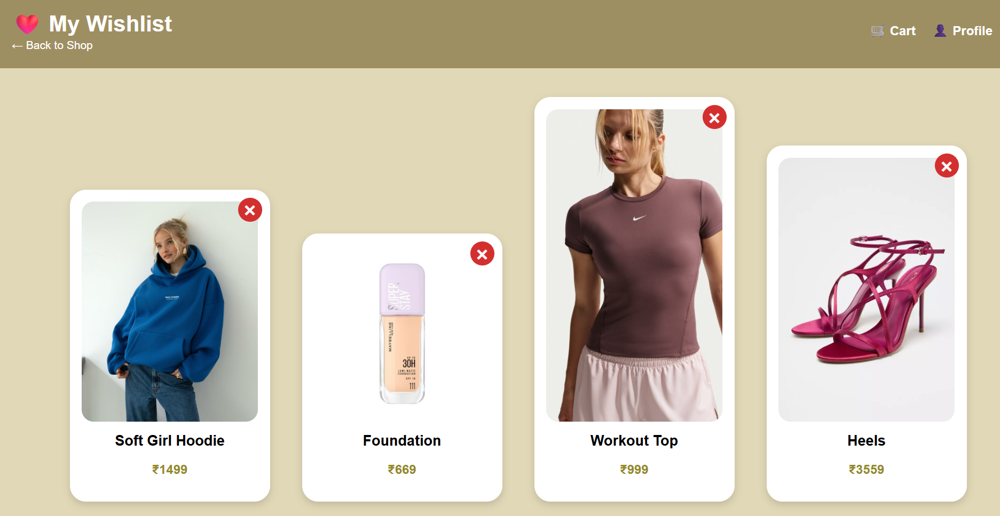

# SlayShopp 🛍️

SlayShopp is a simple and stylish e-commerce website created using HTML, CSS, and JavaScript.
The website allows users to browse products, add them to cart or wishlist, and manage their profile.

## ✨ Features

* 🛒 Add products to cart
* ❤️ Add products to wishlist
* 🔐 User login and registration pages
* 👤 User profile page
* 📱 Clean and responsive design
* 🧭 Easy navigation between pages

## 🛠️ Technologies Used

* HTML
* CSS
* JavaScript

## 📂 Project Structure

SlayShopp
│
├── index.html (Homepage)
├── cart.html (Shopping cart page)
├── wishlist.html (Wishlist page)
├── login.html (User login page)
├── register.html (User registration page)
├── profile.html (User profile page)
├── script.js (Website functionality)
├── style.css (Website styling)
└── images/ (Project images)

## Project Screenshot

## 🚀 How to Run the Project

1. Download or clone the repository.
2. Open the project folder.
3. Open **index.html** in your browser.

## 🌐 Deployment

This project can be deployed easily using platforms like Vercel or GitHub Pages.

## 👩‍💻 Author

Ayusha Udhane

## 📌 Future Improvements

* Online payment integration
* Product search feature
* Product filtering options
* Database integration for users and products

---

⭐ If you like this project, consider giving it a star on GitHub!
